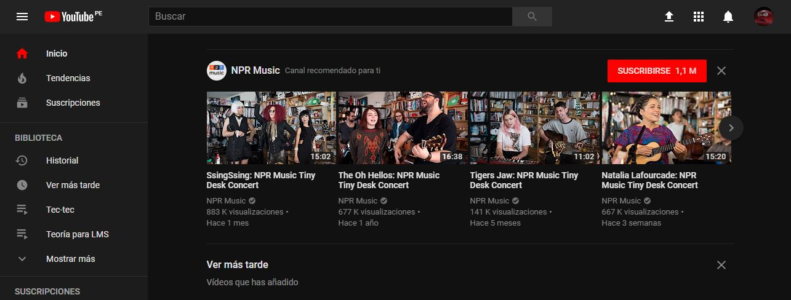

# ¿Qué parte es UX y qué parte es UI?
## YouTube
Site oficial: https://www.youtube.com/.

| UX | UI |
| :---------: | :---------: |
| Que pueda buscar rápidamente el vídeo   | Los colores de la marca (rojo, blanco, gris) |
| Que me suscriba a un canal y reciba notificaciones | Diseño de los botones |
| Que me recomiende canales basados en mi historial de búsqueda   | El diseño del menú "hamburguesa" |
| Que guarde vídeos para verlos más tarde | La barra gris que indica la carga del vídeo en reproducción |
| Que pueda subir vídeos y editarlos | La barra roja de avance en el consumo del contenido del vídeo |
| Que pueda cambiar el navegador a tema oscuro | La barra de carga de los vídeos que se están subiendo |
| Que pueda crear una biblioteca personalizada | La barra que indica la calificación del vídeo |
| Que cambie el modo de visualización del vídeo (modo cine y pantalla completa)| El espacio de color negro en modo cine |
| Que la calidad del vídeo cambie automáticamente, dependiendo de la velocidad de conexión | El diseño del interruptor de reproducción automática |
| Que pueda cambiar la configuración del vídeo | El campo de búsqueda siempre está visible |
| Que reproduzca los vídeos similares automáticamente después de seleccionar uno | El enfoque del menú cuando este se despliega durante la reproducción de un vídeo |
| Que pueda comentar, compartir y calificar un vídeo | El color de la opción seleccionada del menú |
| Que pueda filtrar los comentarios | El desplazamiento de los vídeos en el inicio |
| Que pueda administrar mis suscripciones | La previsualización cuando un vídeo tiene el estado de hover |
| Que pueda administrar mi canal | El diseño del tema oscuro |
| Que pueda acceder a productos de YouTube como YouTube Gaming, YouTube Music, YoutTube TV, etc. | El diseño la biblioteca de audio de Creator Studio |
